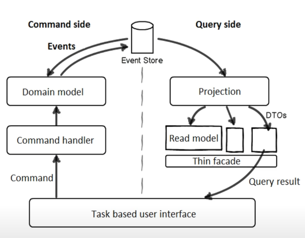

# Communication

Events are transmitted between contexts.
A queue for async communication or microservices.
Internal queue implementation for monoliths.

Translating events to commands can be done:

- in the boundary of the downstream context
- separate router (message router)
- process manager running as part of infrastructure

# Transferring data in events

Event contain DTO objects
DTO types are deserialized into the domain objects on the context boundary.
Domain objects are serialized into DTOs on the context boundary.

# Gates

To ensure objects inside the bounded context are valid, there are gates:

- input gate (validate according to the domain rules)
- output gate (make sure private info doesnt leak out)

# Workflows inside the context

There are multiple workflows within a context, each mapped to a single function with input as command data and output as a list of events.
A workflow is always within a single bounded context.
Domain events within the context should be avoided.

Inputs to workflows are always domain objects inside commands.

# Code inside the context

- Contains all the code necessary to perform its job (db call, api etc.)
- Onion architecture: domain inside, services around, while infrastructure, api and db are outside
- I/O are at the edges

# Pipeline for each workflow

Own composition root for each pipeline with one pipeline per each use-case/workflow.
